Una de las aplicaciónes reales en las que estoy trabajando utiliza **datos geográficos** del recorrido de máquinas de agro para **obtener una serie de estadísticas relevantes**. Utilizo principalmente las librerías Pandas, GeoPandas y Shapely.

Voy a comentar algunos de ellos siguiendo el razonamiento que me llevó a resolver los problemas que se fueron planteando.

# Problemática y recursos disponibles
Disponemos de una serie de datos con el recorrido de una máquina, con su posición geográfica y estado (trabajando, no trabajando).
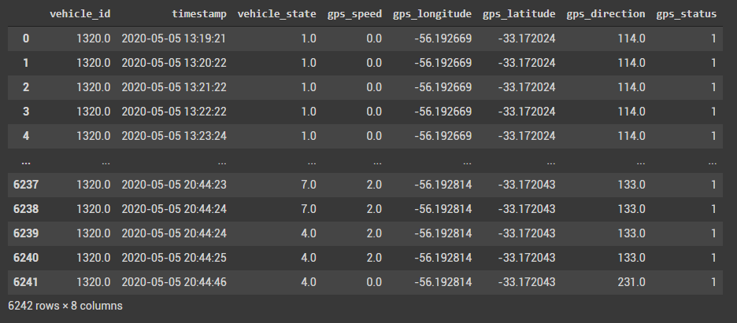
En base a esto necesitamos obtener toda la información relevante que ayude a medir el trabajo realizado.

Algunas de estas estadísticas son:
- Hectáreas trabajadas
- Área solapada
- Distancia entre 2 filas trabajadas
- Detección de cabeceras

Para que alguien no familiarizado pueda entender como funcionan estas máquinas, voy a hacer un breve resumen.

## Máquinas de agro
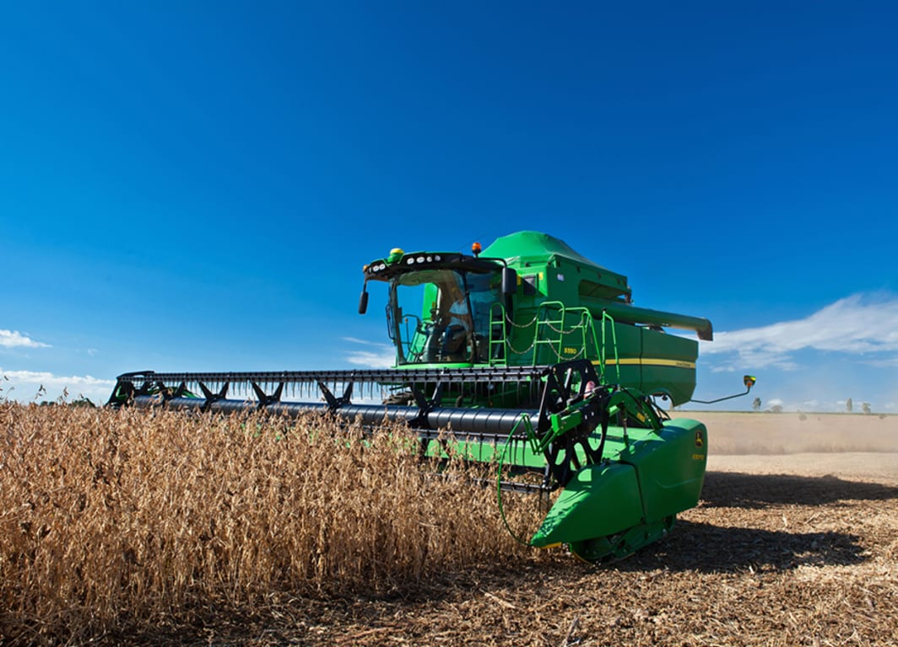
Hay principalmente 2 tipos de máquina que monitoreamos, sembradoras y cosechadoras.
Las sembradoras lo que hacen es colocar las semillas en un campo mientras que las cosechadoras levantan el producto luego de que crezca.

Lo que tienen en común sobre todo es como se comportan, las máquinas tienen un área que sembrar/cosechar, y van cubriendola en zig zag.
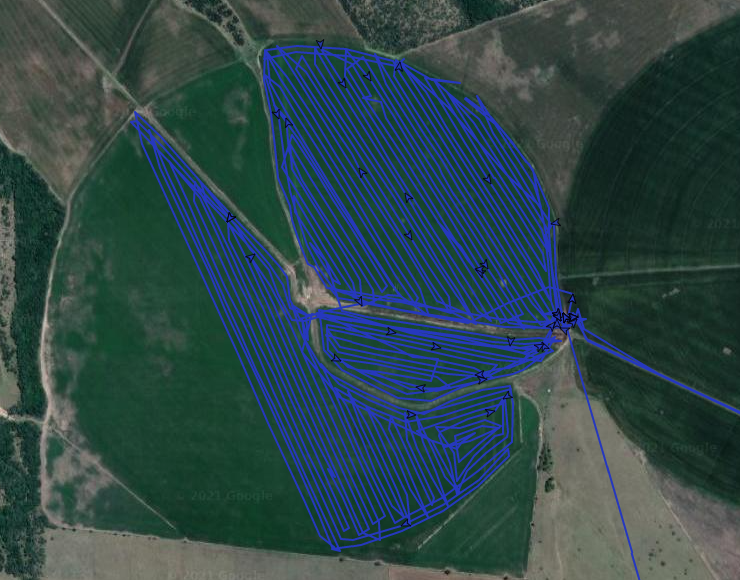
Aquí hay una representación de un recorrido de una máquina.

## Algoritmo 1 - Detección de cabeceras y líneas de trabajo
Un dato no menor, es que al finalizar una línea de trabajo, la máquina levanta el cabezal para poder hacer un giro de 180 grados y avanzar a la siguiente línea. 

Mientras esto ocurre **la máquina no cosecha ni siembra, por lo que esos trozos deberían descartarse.**
Para esto, primero que nada debemos **detectar esos casos** y separarlos de las propias líneas de trabajo.

El algorítmo desarrollado, utiliza los cambios en el ángulo del gps para detectar estos giros de 180 grados, y los compara con el tiempo desde el último dato. De esta forma podemos tener un **ratio de variación de ángulo en el tiempo**. Al superar un determinado valor, se estima que la máquina está haciendo un giro lo suficientemente pronunciado como para considerarlo una cabecera.

Punteo de los pasos para llegar a este resultado:
1. Se calcula la diferencia de angulo entre el dato anterior y el actual, es relevante tomar en cuenta que al pasar de el ángulo 0 al 359 no hay 359 grados de distancia, sino 1.
2. Se calcula la diferencia en tiempo desde el dato anterior y el actual.
3. Se calcula el ratio entre variación de ángulo y variación de tiempo.
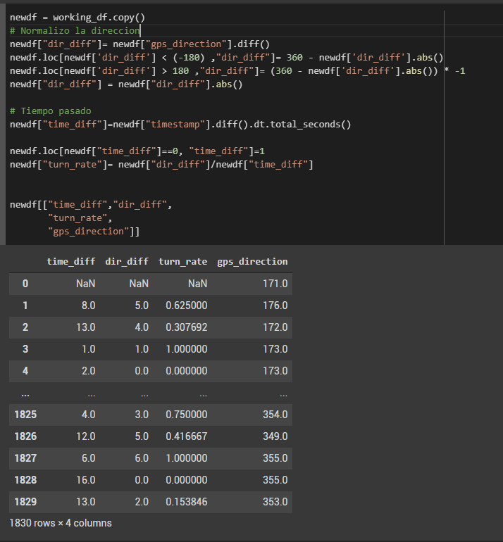

4. Aquellos datos con un turnrate superior a 12 (numero mágico obtenido a base de prueba y error) se les agrega una flag "turning" = 1, y a los demas datos se les asigna un 0.
5. Agrego una columna con la diferencia entre el estado de "turning" del dato anterior y el actual, en aquellos datos donde la diferencia es 0 es que el estado anterior se mantuvo.

De esta forma, si filtro aquellas filas con un cambio de estado de 1 o -1, lo que obtengo son las filas que comienzan un periodo de giro o un periodo de línea.

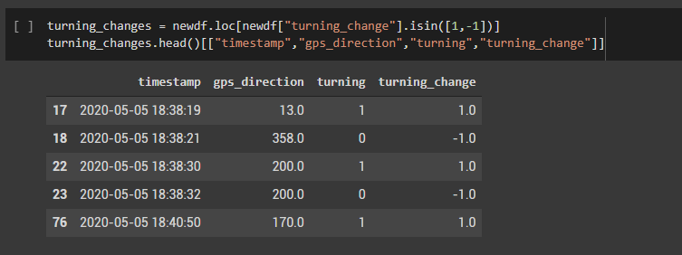

Si separo el dataframe original utilizando las filas del paso anterior, obtengo múltiples segmentos de datos, donde se intercalan líneas de trabajo y cabeceras.

En las siguientes imagenes se pueden ver los resultados, donde en azul se muestran los puntos que componen las lineas de trabajo y en rojo las cabeceras. 
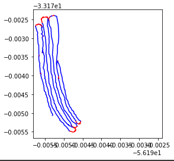
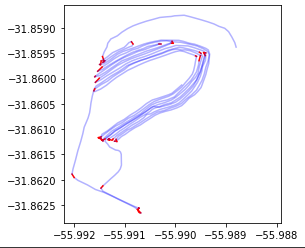

Con algunas optimizaciones posteriores el resultado mejora notoriamente.

## Algoritmo 2 - Cálculo de área de trabajo y solapamiento
Para calcular el área de trabajo, primero necesitamos las **líneas de trabajo** obtenidas con el algoritmo anterior, y postreriormente el **ancho de la máquina**.

Si bien **podría llegar a ser intuitivo** pensar que el área trabajada es la distancia recorrida trabajando multiplicada por el áncho de trabajo, **esto no contempla el solapamiento**.

El solapamiento se da cuando el operador pasa con la máquina por encima de una zona que ya habia sido trabajada previamente. 

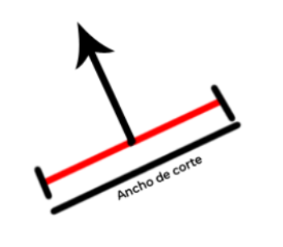

Este algoritmo utiliza **trigonometría con el ángulo del gps** para generar un polígono de trabajo para cada línea, haciendo una suma de todos estos al final para generar un **polígono único descartando las zonas solapadas.**

Asumiendo que el gps del vehículo está en el centro del mismo lo que hacemos es calcular **donde están posicionados sus extremos**. 

Si el ancho de la máquina es de 10 metros, un extremo va a estar 5 metros a su derecha y el otro 5 metros a su izquierda. **Utilizando trigonometría sobre los datos de gps** (latitud, longitud y ángulo) podemos obtener la posición de los 2 extremos.

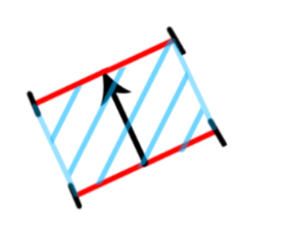
Uniendo estos puntos con los siguientes, obtenemos un área trabajada.

Si bien esto suena bien, **es inviable generar un poligono por cada 2 puntos de la línea**, por lo que basandonos en este concepto, lo que finalmente hice fue lo siguiente:

1. Generar 2 columnas con la posición de gps del extremo derecho de la máquina.
2. Generar 2 columnas iguales a las anteriores pero para le extremo izquierdo.

Finalmente lo que obtenemos son 2 líneas que vienen a representar los extremos de la máquina.

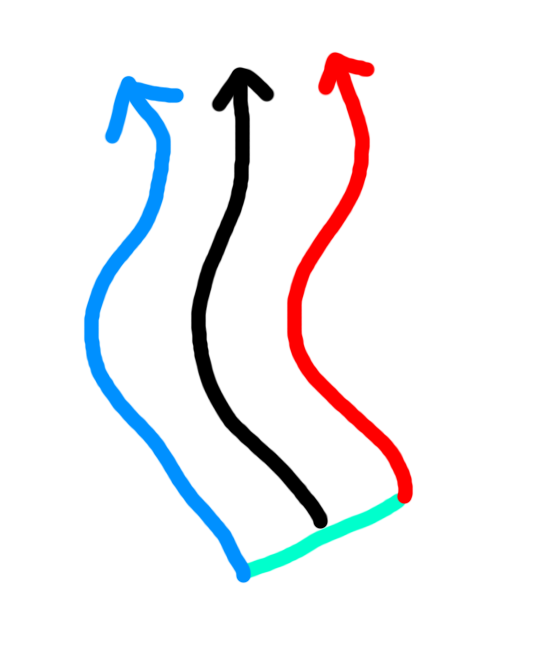

Si unimos esas 2 lineas por sus extremos, podemos generar un polígono que equivale al área cubierta por la máquina en esa línea.

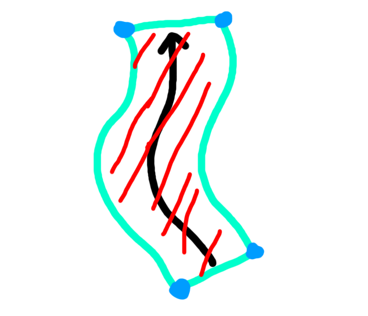

En este punto, si aplicamos este algoritmo **para cada línea** de trabajo vamos a tener una **lísta de polígonos**, muchos de estos se solapan entre si, por lo que queremos saber el área real y también cuanto se solapó.

**El área total** se puede calcular como la suma del área de tódos los polígonos.

Shapely nos disponibiliza una función llamada cascade_union, que toma una lista de polígonos y genera uno nuevo sumando todos ellos, el área de éste polígono pasa a ser nuestra **área trabajada real** (área total - solapamientos).

Si restamos el total - la real, eso nos da el **área solapada**.

## Algoritmo 3 - Detección de entrefila
Un dato que resulta relevante para algunos de los clientes, es la distancia entre una línea de trabajo y la siguiente.

Este algoritmo requiere que el operador trabaje en forma de zig zag, pasando de una linea de trabajo a la siguiente de forma ordenada. 

Las líneas de trabajo son irregulares y estan compuestas por cientos de puntos, por lo que el algorítmo con el que resolví el problema consiste en lo siguiente:

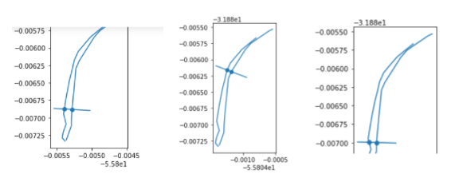
1. Se toman una serie de puntos al azar **(desde ahora A)** de una línea y para cada uno de ellos se traza una perpendicular **(desde ahora P)**. 
2. Estas líneas se **intersectan con la línea de trabajo** siguiente en un punto **(desde ahora B)**.
3. Se mide la **distancia entre A y B**.
4. Se calcula la mediana de estas distancias.

Si bien hay bastante aproximación en el algoritmo, con este enfoque **se obtiene una precision incluso mayor** que en las mediciones hechas manualmente en el campo, ya que se pueden obtener decenas de muestras para cada línea de trabajo. 

