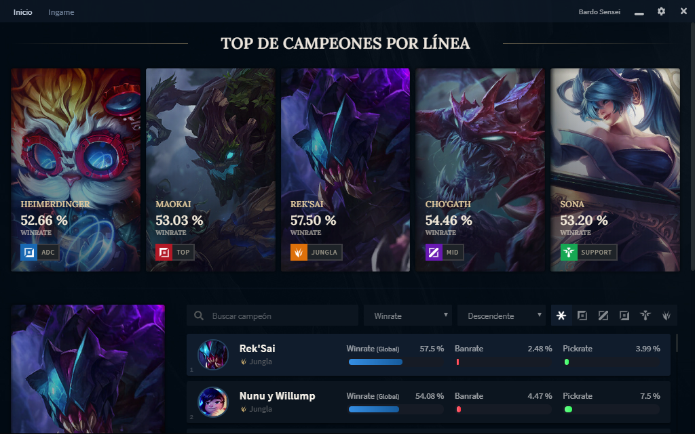
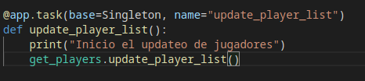
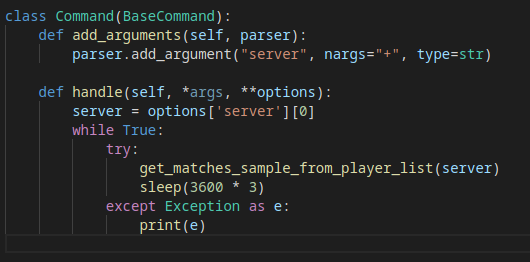
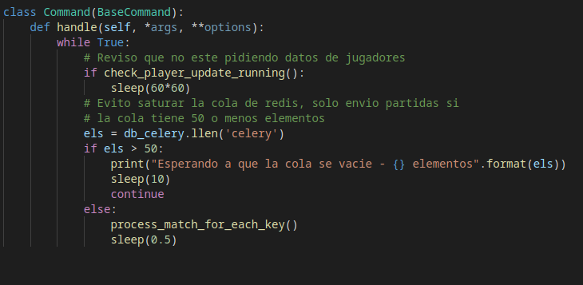
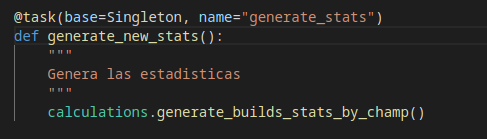

Este es el primero de varios blogs, donde iré explicando mi proceso a la hora de desarrollar la app asistente de League of Legends, hay un [post previo](/portfolio-work-1) en mi portfolio, donde comento por encima como funciona y que hace.

# Necesidades de la app
Como comentaba en el post sobre la app, el objetivo principal es poder generar **estadisticas actualizadas para cada personaje**, de forma que sin necesidad de estar leyendo los parches del juego, **el jugador pueda tomar decisiones** sobre que personajes elegir o bloquear, asi como que equipamiento llevar.

Antes de diseñar la arquitectura lo primero que necesitamos es saber con que recursos contamos y de donde vamos a sacar la información.
En esta caso RiotGames [nos disponibiliza una API](https://developer.riotgames.com/apis), donde se puede obtener **información de jugadores y de sus partidas**.

La api nos facilita un par de endpoints clave que debemos utilizar para llegar al dato final, que es la información final de cada campeón utilizado en una partida.

## Endpoints disponibles
- **/lol/league/v4/entries/{queue}/{tier}/{division}**: Nos da una lista de jugadores en una liga
- **/lol/match/v4/matchlists/by-account/**: Nos da una lista de las partidas de un jugador
- **/lol/match/v4/matches/**: Nos da el detalle de una partida en concreto

En base a estos endpoints, el proceso para llegar al detalle de una partida y obtener los datos de cada campeón es el siguiente:
1. Obtenemos una lista de jugadores de cada liga/division
2. Obtenemos una lista de partidas recorriendo esos jugadores
3. Recorremos esas partidas y obtenemos el detalle de cada una

## Limitantes de la API 
La api nos limita a **cierta cantidad de requests por minuto**, sin embargo **este límite aplica por servidor**, es decir, si superamos el límite en el server de Corea, podemos seguir haciendo request de partidas al server de Norteamérica. De aquí surge una estratégia para optimizar las requests que detallaré mas adelante.

## Plan y arquitectura

El plan es utilizar la librería [Celery](https://docs.celeryproject.org/en/stable/) para mantener procesos corriendo que vayan obteniendo datos de partidas, y a su vez actualizando tanto la lista de jugadores como la lista de partidas, descartando las antiguas y quitando de la lista jugadores inactivos de los que no vamos a obtener información.

De aquí surgen una serie de procesos que van a correr en el servidor para llevar a cabo estas tareas, voy a numerar algunos de los más importantes:

### 1 - Obtención de jugadores

Mediante **Celery Beat**, dia por medio se realiza una recorrida por cada server, liga y division disponible,**almacenando la información de todos los jugadores en PostgreSQL**. De cada uno de ellos se almacena el server al que pertenece, su liga, división, nombre y distintos IDS que se requieren luego para hacer otros requests con la api.

### 2 - Obtención de partidas

Mediante [Supervisor](http://supervisord.org/running.html) se mantienen corriendo un proceso por cada server, cada uno de ellos recorre la lista de jugadores asociados a ese servidor, obteniendo una **lista de partidas recientes**.

Para cada jugador se obtiene la última fecha en la que este proceso lo revisó, de forma que la siguiente vez que se soliciten sus partidas se haga solo con partidas posteriores a esa fecha. De esta forma se evitan duplicados.

Una vez obtenidas las partidas de los jugadores de determinada región, estas **se almacenan en una lista de Redis**, donde la key es la región de la partida.

### 3 - Obtención de detalle de partidas

Utilizando también supervisor, se va extrayendo de la cola de redis de partidas por procesar un puñado de partidas de cada server (de esta forma evitamos en cierta medida el limite de requests de la API).

Estas partidas van a una cola de celery worker donde se solicita su detalle, se recorre la información de cada jugador que participó en ella y todo lo relevante a la misma se almacena en PostgreSQL.

Algunos de los datos que se obtienen de cada partida son: Personajes jugados y bloqueados, asesinatos, muertes y asistencias de cada personaje, objetos y runas de cada personaje, cantidad de minions asesinados por cada jugador, línea de cada personaje, entre otras.

### 4 - Obtención de estadísticas

Una vez ya se han obtenido una buena cantidad de partidas (me he manejado con cerca de 100.000), lo que se hace es utilizar pandas para obtener estadisticas de cada personaje. Este proceso se ejecuta mediante Celery Beat cada 24 horas o cuando se detecte un cambio de parche en el juego, para mantener las estadísticas actualizadas.

En 100.000 partidas, al haber 10 jugadores, hay un muestreo de 1.000.000 de datos totales si lo dividimos por personaje. De esta forma podemos obtener los siguientes datos de cada personaje:

- Líneas frecuentes en las que se juega
- Ratio de veces que se elige/bloquea
- Ratio de victorias/derrotas
- Objetos y runas con mayor ratio de éxito
- Personajes contra los que se gana/pierde mas 
- En que minuto de la partida se gana/pierde más

Algunas de esas estadísticas es relevante contrastarlas segun que línea se esté jugando, es decir, el equipamiento de un personaje puede ser muy distinto si se está jugando como Soporte o como Medio. De esta forma podemos obtener **varias builds distintas para cada personaje de acuerdo a la línea asignada.**

Estas estadísticas tienen una estructura considerablemente compleja, y se almacenan en MongoDB.
El análisis de los datos es demasiado extenso para comentarlo en detalle en este post, pero quizá escriba al respecto más adelante.

# Comentarios finales

En este punto ya obtuvimos las estadísticas de cada personaje en cada línea, por lo que en el siguiente post voy a estar escribiendo sobre como diseñe el frontend, que funcionalidades tiene y que tecnologías usé.

[Siguiente post - Frontend de la app](/frontend-lol-app/)