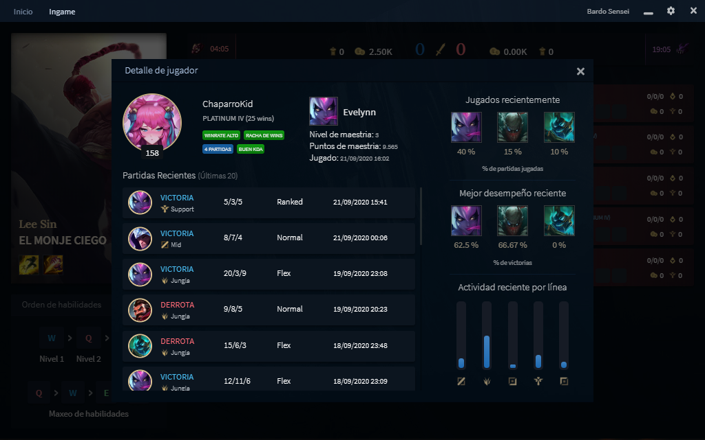
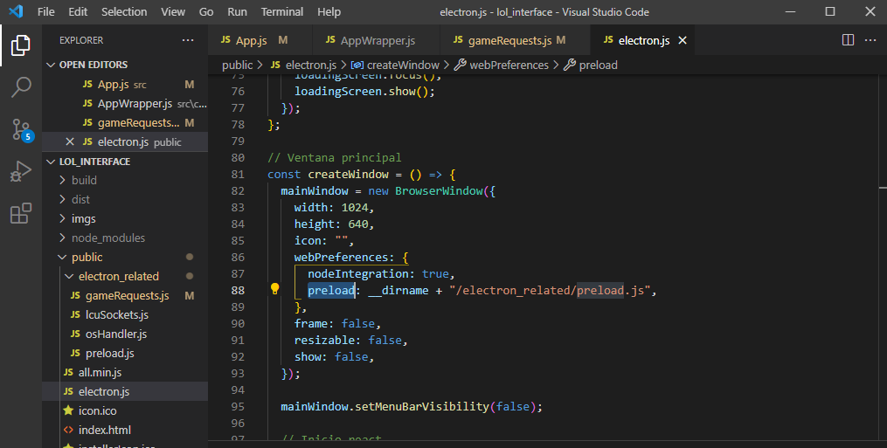
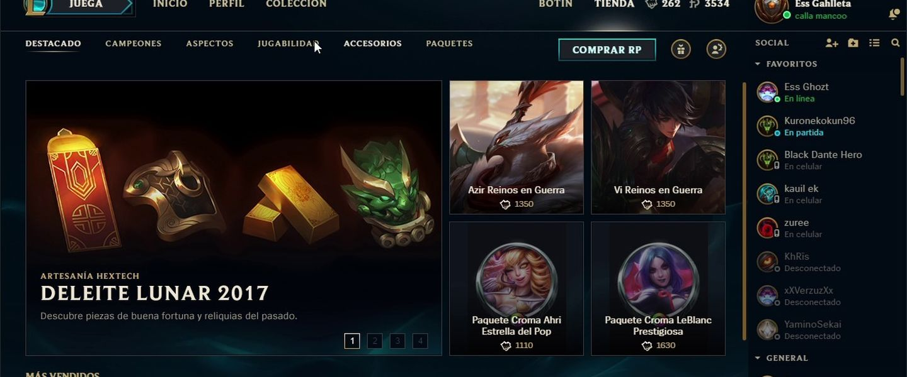
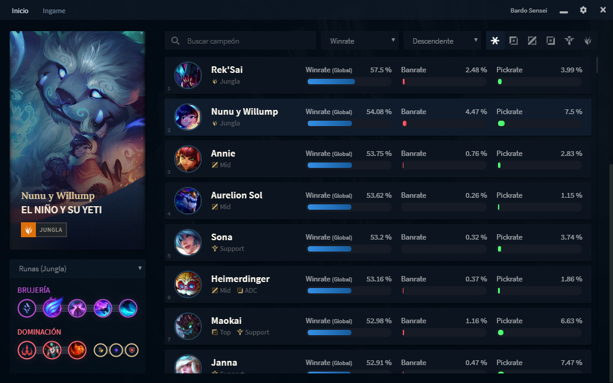
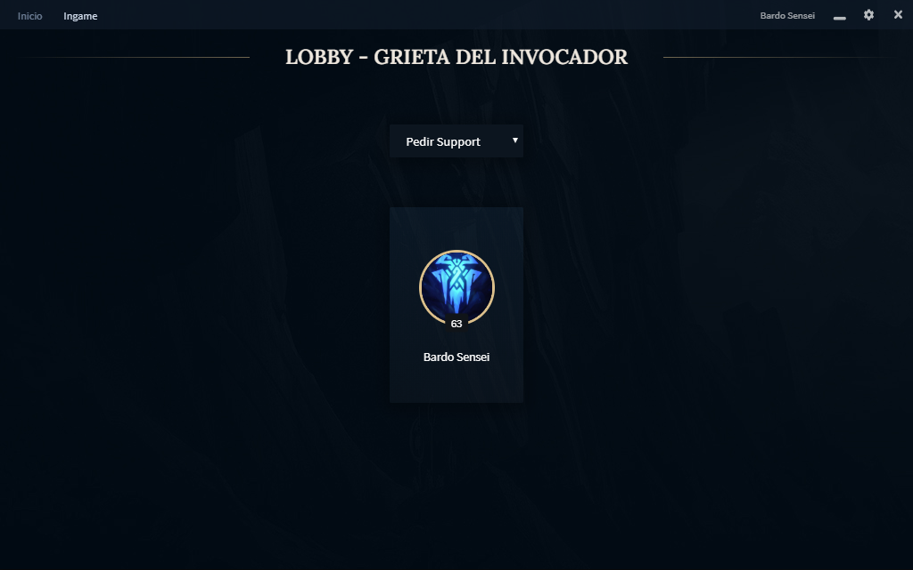
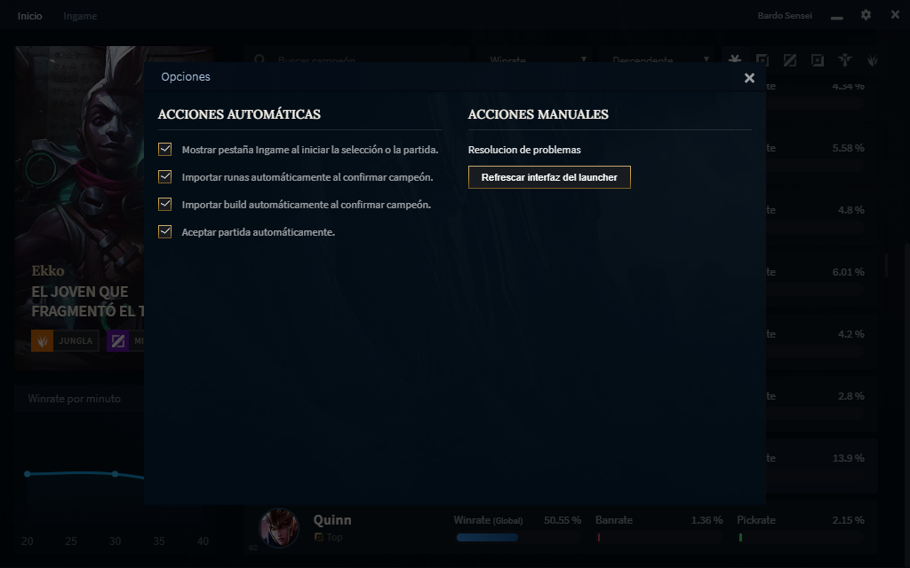
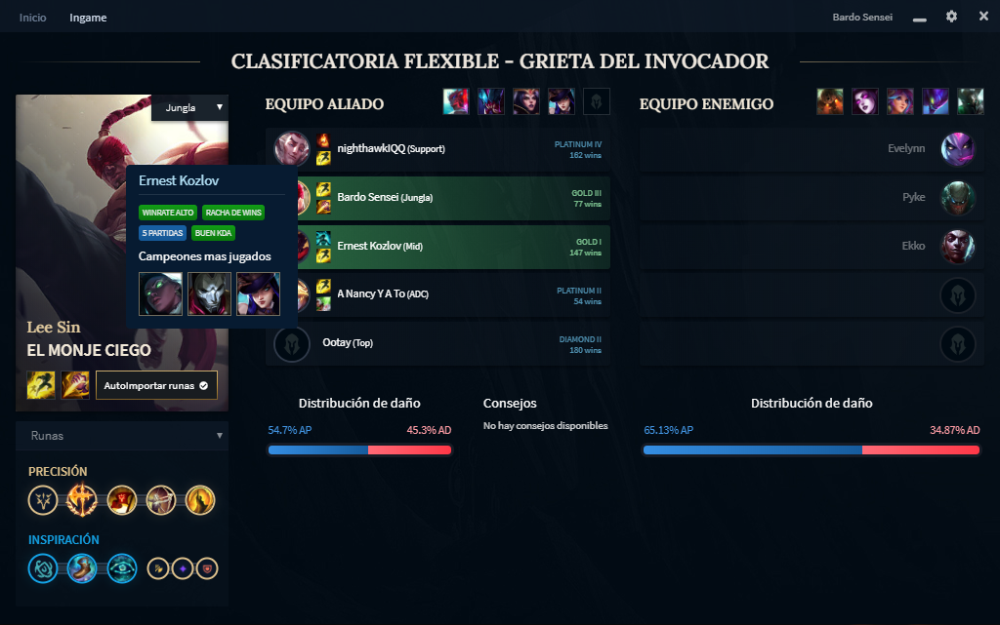
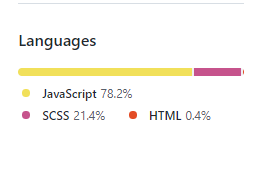

En este post voy a explicar un poco como desarrollé el frontend de la app asistente de League of Legends, hay un [post previo](/arquitecture-lol-app), donde comento la arquitectura del backend. 

# Necesidades de la app
En la parte frontend, se requiere una app de escritorio que por un lado muestre las estadísticas de todos los personajes obtenidas desde backend, y a su vez que se pueda conectar al launcher del juego, de forma que segun el feedback que reciba del mismo más las estadísticas, se pueda dar una serie de consejos.

# Tecnologías utilizadas
Como es mi framework de preferencia, utilicé ReactJS para la interfaz, y de paso utilicé también electron para que la app fuera de escritorio. 

Fue mi primera aproximación a electron, y resulta que no se lleva del todo bien con ReactJS (al menos utilizando create-react-app), asi que el setup del proyecto fue relativamente mas complejo de lo esperado. Pero finalmente todo funcionó como correspondía e incluso pude habilitar features realmente útiles como actualizaciones automáticas.

## El setup de ReactJS + Electron

Por un tema de practicidad siempre utilizo create-react-app al iniciar un proyecto de react. Por la complejidad del manejo del state, en este caso utilicé tambien Redux.

Electron en este caso no solo va a servir para hacer la aplicacion un ejecutable, sino que tambien se va a encargar de la conexión con el launcher del juego.

El setup con electron en este caso, se aplica dentro de la carpeta public, donde al ejecutarse electron pasa a cargar el index.html generado por reactjs. A su vez disponibiliza a nivel de la ventana sus funciones, para comunicarse con el lado de react.

Una vez hecho esto, hay que generar una serie de eventos para disparar desde react, que permitan realizar todas las acciones que solo pueden ejecutarse desde electron.

En este caso el ipcRenderer va a servir como puente entre react y electron, en la práctica va a funcionar como funciones asíncronas que se llaman o se escuchan desde react.

## Comunicación con el launcher

El launcher de league of legends utiliza ciertas tecnologias web, y habilita una serie de endpoints y sockets que pueden utilizarse para recibir feedback en tiempo real. 

Para comunicarse con el es necesario chequear un archivo temporal que se genera en la carpeta de instalación del juego y almacena un juego de clave/valor para hacer estas requests. En este caso para no reinventar la rueda, decidí utilizar [una pequeña librería](https://github.com/Pupix/lcu-connector) que se encarga de escuchar los cambios en ese archivos y facilitar la conexión.

Por otro lado, una vez que hay una partida en curso, se habilita un endpoint que permite traer información de la partida en curso, minuto de partida, temporizadores de objetivos, builds actuales de cada jugador, etc.

## Desarrollando las funcionalidades

El primer paso para que la aplicación funcione, es traer las estadísticas desde nuestro backend y poder visualizarlas, no hay mucho que ampliar aquí. Las funcionalidades básicas son mostrar un listado con estadísticas básicas y múltiples filtros. Al hacer foco en un campeón se pueden ver otros detalles relativos al mismo, como las builds recomendadas.

Una vez eso está listo, pasamos a la parte de gestión de estado con redux. 

Hay múltiples estados posibles para el launcher:
- Inactivo 
- Creando sala / Buscando partida
- En selección de campeón
- Jugando

Según el estado actual, en la pestaña Ingame de la app se debe mostrar una cosa u otra. 
En electron desarollé una serie de listeners que envian mensajes a react, de forma que al recibir estos mensajes react vaya actualizando el state de la aplicación en redux, estas actualizaciones constantes de state permiten que la aplicación le siga el ritmo **(y extrañamente, aveces supere)** al launcher del juego. 

### En sala / Buscando partida
En este estado, se debe mostrar a toda la gente que esta en tu sala, y deberías poder chequear también estadísticas de los demás.

En ciertas partidas se acostumbra solicitar la línea por chat, donde el primero que la pida "se la queda", por lo que también agregué una funcionalidad que permita **enviar instantáneamente la línea deseada** al ingresar a la selección de campeón, esto en mi experiencia consigue que **en 9 de cada 10 partidas consigas la linea que quieras.**

Por otro lado, otra feature útil es la de **aceptar automáticamente la partida**. Dependiendo de ciertas condiciones, se puede demorar varios minutos en encontrar una partida, por lo que si te distraes y no alcanzas a darle al botón de aceptar se pueden perder varios minutos. 

### En selección de campeón

En este estado, se debe mostrar el estado actual de la selección de campeón, asi como consejos sobre que personajes banear o elegir para poner la balanza a tu favor.

Por otro lado, se debería poder **obtener información automáticamente** de los jugadores aliados para **saber que líneas o personajes juegan**, y así facilitar la cooperación y contar con cierta ventaja que al entrar a ciegas no se tiene. Se puede ver también un **historial de partidas de cada jugador** aliado, lo que da un mayor panorama.

Esta información de jugadores, se trae desde el propio launcher, por lo que **no es necesario utilizar requests mediante la api de Riot** que se utiliza principalmente en backend.

Una feature fundamental en estos casos, es la de **cargar el equipamiento recomendado** para el campeón actual, la app permite cargarlo automáticamente al seleccionar un campeón, o de forma manual.

Las runas se cargan utilizando un socket hacia el launcher, mientras que las builds se cargan agregando un archivo JSON a los archivos del juego, de forma que al estar en partida y entrar en la tienda te muestre una lista de objetos recomendados por la app.

### En partida

En esta pantalla se van mostrando **datos de la partida en curso**, estan accesibles todas las estadísticas del estado anterior pero esta vez también para los **jugadores rivales**. 

Por otro lado se muestran tambien la **distribución del oro** entre los equipos, los objetos actuales, el minuto de partida, jugadores actualmente vivos o muertos y cuanto tiempo queda para el spawn de los distintos objetivos dentro del juego.

# Comentarios finales
Con esto lo que sería la descripción básica de las funcionalidades del frontend quedan cubiertas, sin haber entrado en mucho detalle. 

El desarrollo de esta parte fue bastante mas largo que el de backend, incluso cuando la arquitectura es más simple.
El css es casi en su totalidad hecho a mano lo cual supuso una buena parte del tiempo dedicado a eso. 

En cuanto a la interacción con el launcher, [dejo aquí](https://lcu.vivide.re/) una web donde pude obtener algo de información acerca de los endpoints que hay disponibles para interactuar con el mismo, de todos ellos realmente muy pocos funcionan, por lo que la web debe estar desactualizada. A base de prueba y error encontré aquellos que necesitaba y siguen funcionando.

Básicamente **toda acción dentro del launcher puede dispararse desde un endpoint** de estos, asi que las posibilidades son muy amplias.
Con esto finalizo por el momento la explicación acerca de la app asistente de League of Legends.