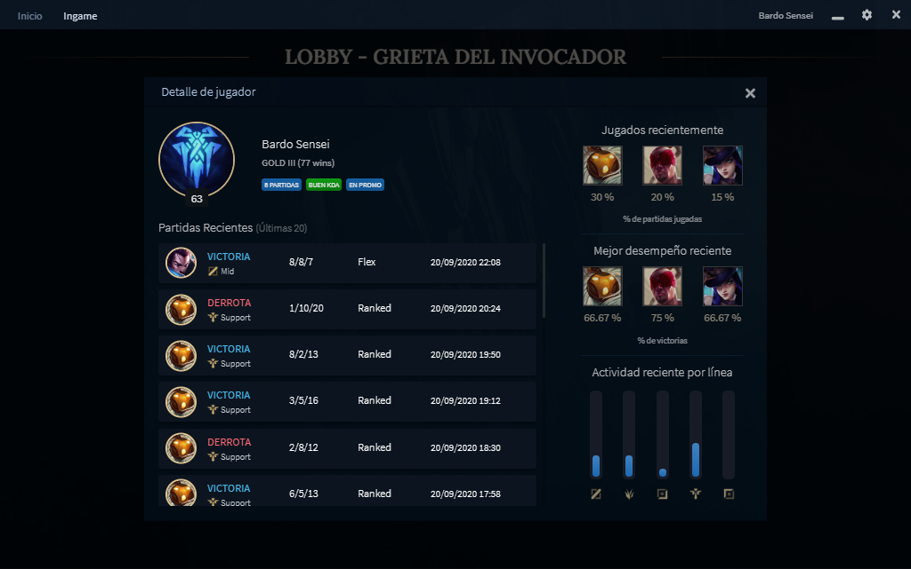
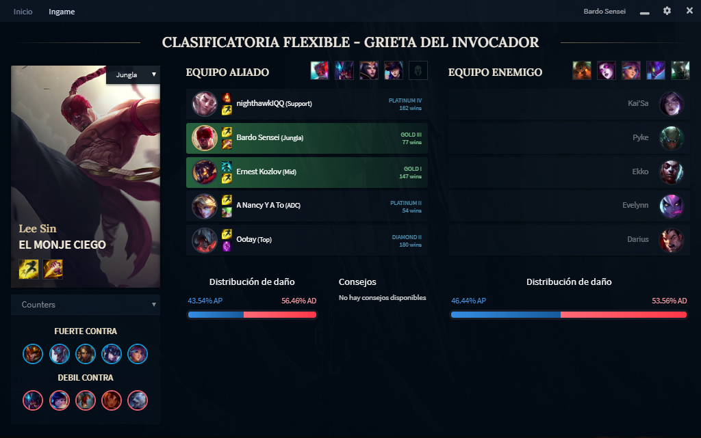

---
Con la llegada de la pandemia me propuse hacer un **sistema relativamente más complejo de lo usual** a modo de proyecto personal, lo primero a lo que apunté fue a crear una aplicación que sirviera de **asistente para League of Legends**, un juego que frecuento. Existen multitud de aplicaciones que hacen lo mismo, pero **el foco era hacer todo el proceso y aprender lo que fuera necesario en el camino.**

# Para entender la aplicación, hace falta un poco de contexto sobre el juego

[League of Legends](https://www.leagueoflegends.com/es-es/) es un juego multijugador 5vs5, donde cada jugador maneja un personaje de entre mas de 150.
El objetivo del juego es destruir la base enemiga.

La gran cantidad de contenido que tiene el juego, sumado a la frecuencia de los parches que modifican el nivel de poder de los personajes, hace muy dificil mantenerse al día sobre que campeón es mas fuerte, cuales no conviene jugar, etc.

---
# Objetivo de la app

El objetivo para la aplicación era que por un lado, diera **estadísticas confiables** acerca del estado actual de los personajes, en cuanto a cuales son mas fuertes/débiles, así como el equipamiento correcto para cada uno.
Por otro lado, también debería **brindar asistencia durante el juego** y la selección de personajes, haciendo recomendaciones, **interactuando con el propio juego** y **dando información sobre jugadores aliados y rivales**.

---
# Arquitectura y tecnologías

Las tecnologías utilizadas fueron **Python** para backend, y **JavaScript** para el frontend. Python da facilidades a la hora de armar una API utilizando la libreria **Django**, y también facilita la generación de estadísticas gracias a la librería **Pandas**.

La arquitectura será desglosada en varios blogs, donde voy a explicar como funciona la [API de RiotGames](https://developer.riotgames.com/docs/lol) y como obtuve las estadísticas e interactué luego desde frontend con el Launcher del juego, asi como algunos algoritmos que desarrollé en el camino.

Resumiendolo muchísimo, el backend utiliza **Celery** para obtener información de partidas de jugadores (que se almacena en **PostgreSQL**), priorizando aquellos jugadores en una liga elevada ya que son los que mejor juegan y por ende, son la fuente de información más confiable.

En base a estas partidas, se realizan una serie de estadísticas para cada personaje (que se calculan con **Pandas** y se almacenan en **MongoDB** por la complejidad de los documentos), estas estadísticas se solicitan desde frontend utilizando una API de **Django**. El frontend (**Electron + ReactJS**) utiliza estas estadísticas para realizar recomendaciones, y obtiene información de la partida en curso en tiempo real mediante un WebSocket que conecta la app con el proceso del juego, lo que le permite a su vez interactuar con el mismo, **automatizando acciones** como seleccionar equipamiento, posición, aceptar partida, etc.

---
# Detalles sobre el desarrollo
La aplicacion se puede descargar e instalar en windows, el código de la app y el instalador estan en github, accesible en los siguientes enlaces:
[Frontend](https://github.com/fabran99/LolHelperFrontend) y [Backend](https://github.com/fabran99/LolStatisticsBackend)

Iré agregando links a los blogs donde escriba sobre la arquitectura de la app y los distintos algoritmos que usé durante el desarrollo.

[1- Arquitectura del backend](/arquitecture-lol-app/)

[2- Frontend con Electron y ReactJS](/frontend-lol-app/)

## Actualización
Debido a una reciente reestructuración en toda la API de RiotGames, las estadísticas de personajes no se estan actualizando, no tengo prevista una fecha para cuando vaya a parchear la app haciendola compatible con la nueva API. La app sigue funcionando con estadísticas de un parche anterior, por lo que aún se puede probar.

