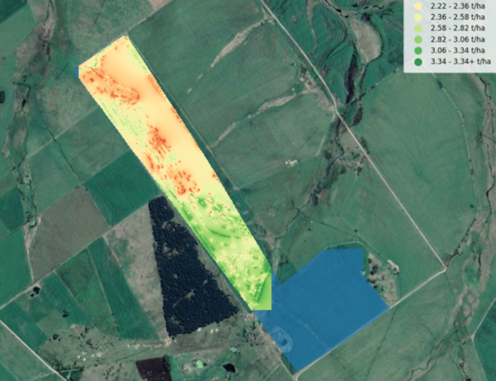
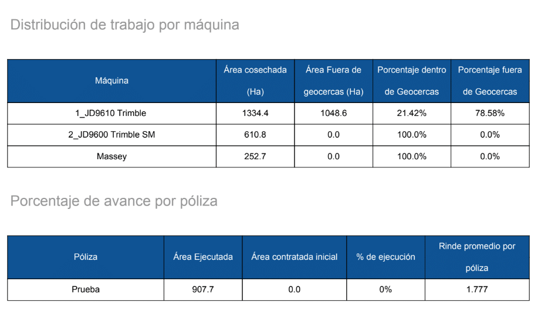
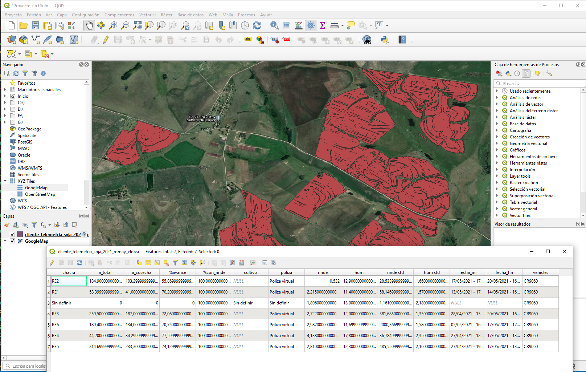
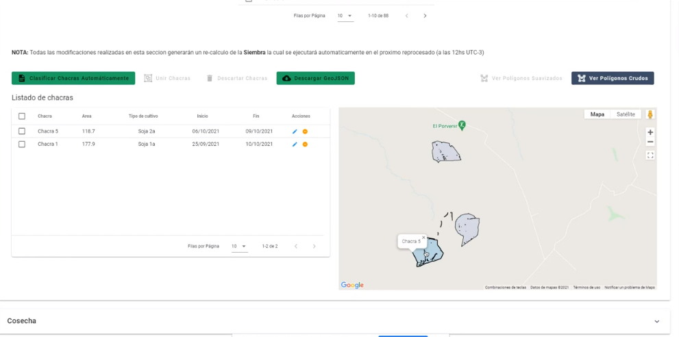

La aplicación en cuestión esta siendo desarrollada incrementalmente y nuevas features van a irse agregando, por lo que paso a comentar brevemente en que consiste.

El objetivo de la misma es brindar una serie de **estadísticas para productores agrícolas**, la empresa dispone de equipos que relevan información de posición y rendimiento de las cosechadoras y sembradoras.

El lenguaje utilizado es **Python**, las librerías Pandas, GeoPandas y Shapely se usan para el analisis de datos, y Django para la API. 

# Algoritmos principales
Durante el desarrollo de la aplicación, programé una **serie de algorítmos sobre los que escribí** en [este post](/agro-algorithms/) y pueden resultar interesantes.

# Funcionalidades principales que desarrollé
## Reportes de avance durante la zafra actualizados cada 8 horas

Estos reportes detallan:
- Área trabajada por las máquinas
- Área solapada
- Porcentaje cosechado en cada chacra
- Mapa de rendimiento de cada chacra
- Rendimiento promedio de cada chacra
- Humedad promedio de cada chacra
- Detección de zonas de las chacras con bajo rendimiento
- Detección de errores en los equipos 
- Máquinas utilizadas en cada chacra
- Polígono de avance con área cosechada de cada chacra
- Fecha de inicio y fin de cosecha o siembra de cada chacra

Los reportes se guardan en varios formatos según el tipo de información que se brinde, entre ellos Excel, PDF, Docx, ShapeFile.

## API para uso en frontend

- Agrupación de información por empresa
- Detección de eventos que requieran accionar del equipo a campo
- Gestion de máquinas y de chacras asociadas a cada zafra
- Detección de chacras a partir de polígonos de avance en siembra
- Subida de polígonos de chacras a partir de GeoJSON
- Exportación en todos los formatos mencionados en la funcionalidad anterior

# Comentarios finales
La aplicación brinda al productor una serie de estadísticas que ayudan a optimizar el uso de los campos, **mejorando la productividad** y permitiendo priorizar aquellos campos con mejor rendimiento.

A su vez, los resultados de cada siembra ayudan a ** **, identificando las zonas sembradas, el tipo de cultivo de cada una y las fechas de inicio y fin exactas de cada proceso.

